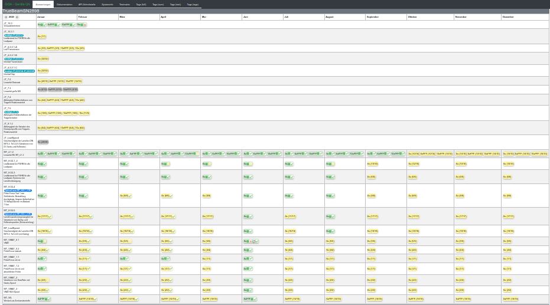

# Dokumentation

**pyGQA** wurde entwickelt um die Qualitätssicherung von Linearbeschleunigern in der Strahlentherapie zu verbessern.

Im Zeitalter der Digitalisierung lassen sich viele Messungen zeit- und ressourcensparend 
mit dem geräteeigenen MV-Detektor durchführen. **pyGQA** hilft bei der Auswertung der DICOM-Bilder, 
indem es automatisch die Datenbank nach neuen Bildern für einen Test durchsucht und diese analysiert. 
Das Ergebis ist ein archiv-tauglicher PDF-Report und eine interaktive Übersicht über abgeschlossene und 
anstehende Konstanzprüfungen mit Ampel-System (Pass/Warning/Fail).
Der Anwender hat über den Python-Code die volle Kontrolle über die Auswertungsmethode und die Fehlergrenzen.

**pyGQA** basiert auf dem großartigen [Pylinac-Projekt](https://github.com/jrkerns/pylinac), wurde aber um einige Features erweitert:
- Konstanzprüfungen nach DIN statt TG-142
- bequeme Bedienung über Webbrowser: Auswertung mit einem(!) Klick
- automatisierte Datenabfrage: kein Bildexport/-import nötig (Varian)
- "Skelett" für einfache Installation
- Testpläne verfügbar (Varian)

**pyGQA** ist am Institut für Medizinische Strahlenphysik und Strahlenschutz am Klinikum Dortmund, 
in Kooperation mit der Praxis für Strahlentherapie am Klinikum Dortmund und der Technischen Universität Dortmund entwickelt worden.

Wir haben **pyGQA** entwickelt um uns die Arbeit zu erleichtern. 
An eine Veröffentlichung haben wir erst gedacht, als uns immer mehr Nachfragen aus anderen Kliniken erreichten. 
Dementsprechend befinden sich viele Module und Funktionen noch im Stadium "learning by doing" und die Dokumentation 
ist ein halbvollständiger Deutsch-Englisch-Mix.

Wir starten mit zwei fertig konzipierten Tests aus unserer monatlichen Qualitätssicherung:
- Linearität des Dosismonitorsystems bei kleinen Dosismonitorwerten
- Geschwindigkeit und Geschwindigkeitsänderung der Lamellen

Derzeit ist **pyGQA** auf unsere eigene Hard- und Softwarekonstellation abgestimmt:
- Varian TrueBeam und VitalBeam v.2.5, beide mit 120er MLC
- Varian ARIA/Eclipse v.13.6
- Linux Server für den Auswertungssoftware und Webserver im Intranet

Noch keine Erfahrung mit Python?

Die Seite https://www.python-kurs.eu/index.php gibt einen guten Einstieg in die Programmierung mit Python.

Wer einfach einzelne Auswertungen vornehmen möchte, dem sei das Tool [pyqaserver](https://github.com/brjdenis/pyqaserver) empfohlen.

## Haftungsausschluss:
Die Durchführung der Konstanzprüfungen und die Bewertung der Ergebnisse liegt in der Verantwortung 
des zuständigen Medizinphysik-Experten.  
Alle Auswertungen müssen sorgfältig geprüft werden.  
Die Verwendung von **pyGQA** liegt im Ermessen des Anwenders und wir übernehmen keinerlei Verantwortung 
für die Korrektheit der Ergebnisse.

## Installation und Konfiguration

* [Installation (en)](docs/en/installation.md)

Durch Bearbeiten der Konfigurationsdateien im Ordner `config` die Konfiguration anpassen.  

Allgemeine Anpassungen werden in [Konfiguration (de)](docs/de/Konfiguration.md) beschrieben.  
Zusätzliche Anpassungen werden in [Konfiguration GQA (de)](docs/de/Konfiguration-QA.md) beschrieben.  

Eine Beschreibung der Tests befindet sich in: [GQA-Test (de)](docs/de/GQA-Tests.md)

Einfache Installation für Mac User: [MacDummies](docs/de/MacDummies.md)

## Erster Start

1. Auf der Konsole in das repository Verzeichnis mit `cd` wechseln.
2. Starten mit: `<your pythonpath>/python ./pygqa.py` 

Der Oberfläche von **pyGQA** ist jetzt über die URL: **127.0.0.1:5000** oder die in der `config` angegebenen Parameter erreichbar.

## Zugriff

    /                   - Interface with documentation / Oberfläche mit Dokumentation
    /api                - Documentation of the API interface / Dokumentation der Api Schnittstelle 
    /api/{class}/{id}   - Access to the API interface / Zugriff auf die Api Schnitstelle
    /docs               - Documentation of the program / Dokumentation des Programms

## Wichtige Komponenten
* [pylinac](https://pylinac.readthedocs.io/en/stable/) für die Auswertung der Testdaten
* [flask](https://de.wikipedia.org/wiki/Flask) und [safrs](https://github.com/thomaxxl/safrs/) für die Weboberfläche und API-Schnittstelle 
* [weasyprint](https://weasyprint.readthedocs.io/en/stable/tutorial.html) für die Erstellung der PDF Ausgaben
* [Pandas](https://de.wikipedia.org/wiki/Pandas_(Software)) für die Gruppierung der Testdaten und Erstellung von Tabellen für die Ausgabe
* [unittest](https://docs.python.org/3/library/unittest.html) für die Prüfung der internen Abläufe besonders nach Programmänderugen
* Das [MQTT-Protokoll](https://de.wikipedia.org/wiki/MQTT) wird verwendet um Informationen zwischen verschiedenen Anwendungen zu übertragen
* [node-red](https://nodered.org/) wird verwendet um MQTT Meldungen zu prüfen, zu verarbeiten und weiterzuleiten

Durch die Verwendung der inline API-Dokumentation von **safrs** ist es möglich autom. eine API Beschreibung zu generieren.
Durch einen Aufruf der Python Dateien in Ordner **tests** kann der Systemlauf geprüft werden. Ein Aufruf von **all_unittest.py** aktualisiert zusätzlich die Dokumentation der python module. 

## Zukunft

* [ ] Dokumentation in Englisch und/oder Deutsch
* [ ] Weitere Tests implementieren
* [ ] Trends über alle Ergebnisse
* [ ] Templatesystem für die PDF Erstellung statt fester Angaben im source
* [ ] Verwendung von ESAPI https://github.com/VarianAPIs/PyESAPI als Verbindung zum Aria anstelle einer SQL Verbindung.
* [ ] Datenbank für die Testergebnisse statt json Dateien
* [ ] Wechseln von pylinac Version 2.3.1 zu pylinac Version 2.4.0
* [ ] Verwendung von Python 3.8 und 3.9
* [ ] Überarbeitung und Erweiterung des DICOM Moduls  

## Fehler und Anmerkungen

Der beste Weg, uns zu erreichen, besteht darin, auf Github ein Issue zu erstellen. 
